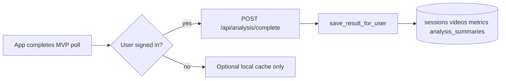

# History and chat data flow (after fix)

## Writes

## Reads

| Screen / feature | Endpoint | Data used |
|------------------|----------|-----------|
| Progress | `GET /api/user/analysis-history` | `overall_score`, metrics, session_id, video_id |
| Home | `getUserStats`, `getUserStreak`, `getAnalysisHistory` | Same score semantics as Progress for “last session” and recents |
| Coach J | `build_user_context` | `get_recent_summaries`, `get_user_stats`, profile |

## Legacy

`GET /history/{user_id}` remains for backward compatibility but is **deprecated** for mobile: unauthenticated and bypasses RLS on the server. New work should use Bearer-only routes.
